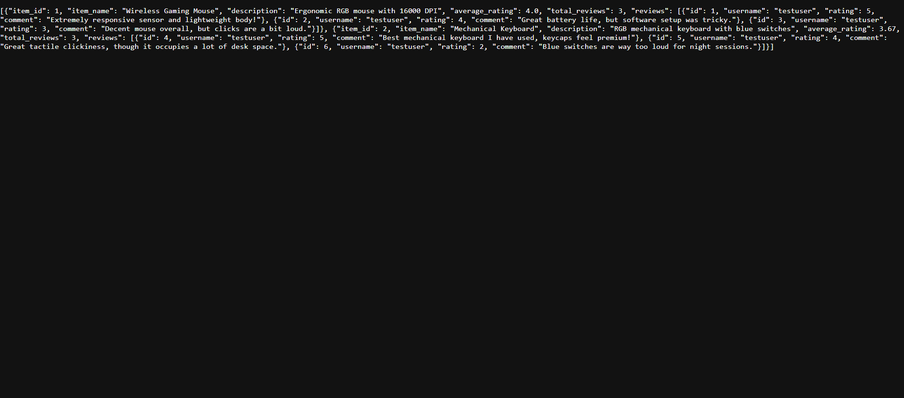

# Rating & Review Platform Backend

A zero-dependency RESTful API built purely with standard Python libraries (`http.server`, `sqlite3`, `hashlib`, `json`). It supports user registration, token-based authentication, product item creation, and review submissions, featuring a consolidated dashboard endpoint.

**Prerequisite:** Requires Python 3.8+

---

## Features

* **Zero Dependencies**: Built entirely with native Python standard libraries.
* **Token Authentication**: Secure bearer token authorization stored in SQLite.
* **Consolidated Endpoint**: `/dashboard` route returns items, computed average ratings, and nested user reviews in a single JSON payload.
* **Relational Storage**: Relational SQLite database managing users, items, and reviews.

---

## API Summary

| Method | Endpoint | Description | Auth Required |
| :--- | :--- | :--- | :--- |
| `POST` | `/register` | Register a new user (`username`, `password`) | No |
| `POST` | `/login` | Authenticate user and receive bearer token | No |
| `POST` | `/items` | Add a product item | No |
| `GET` | `/items` | List all items with calculated average ratings | No |
| `POST` | `/reviews` | Submit a review (`item_id`, `rating`, `review_text`) | **Yes** |
| `GET` | `/reviews` | Fetch reviews for a specific item (`?item_id=X`) | No |
| `GET` | `/dashboard` | Fetch all products with nested reviews | No |

---

## How to Run

1. Open your terminal or command prompt.
2. Run the server script:

    python main.py

*(Note: Use `python3 main.py` if you are on Linux/macOS).*

3. **Database Initialization**: A local SQLite database file will automatically generate in the root directory upon first boot. 
4. The server will start locally. You can access the API at `http://localhost:8000`.

---

## Dashboard Output

Visit `http://localhost:8000/dashboard` in your browser to view the structured JSON response:

